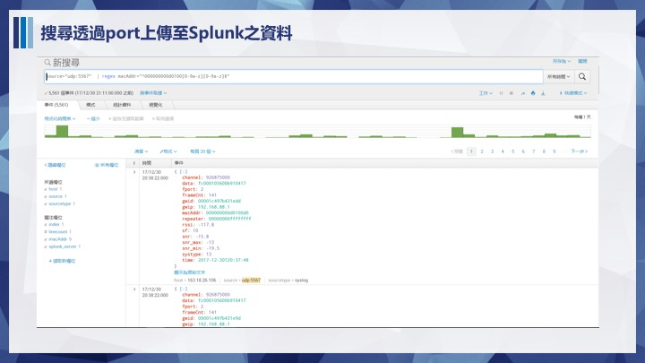
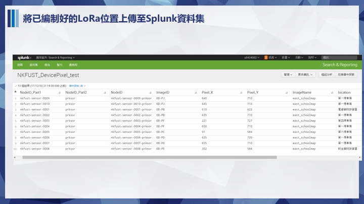
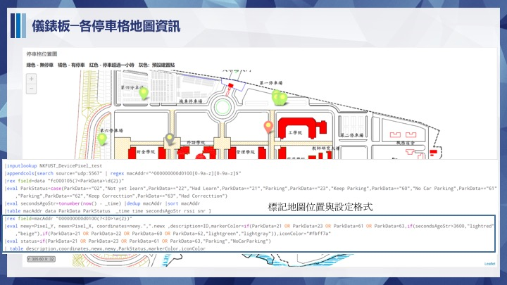

#學校網管及智慧停車系統

#指導老師：朱彥銘

#組員：莊博馨、曾瓊瑩、蔡心敏、林薏庭、陳沛穎

內容:從Client端Ping各段閘道網路，校外網路用DNS測試，定時將ping的值回傳到Splunk,再由Splunk分析，若回傳時間超過訂時間，便發出Alert提醒網管人員．
而智慧停車系統則是，透過感測器偵測停車格是否有停車，將資料回傳至Splunk監看，再進行分析．

效益:讓網管人員即時知道哪段網路出問題，且可以即時知道校園內停車狀況．

HOW:用PYTHON寫好的程式，使用MQTT傳輸協定傳送至SPLUNK，在使用SPLUNK告警功能發出錯誤的LOG檔
>功能性需求
>1.偵測是否斷線
>
>2.監控網段連線狀態
>
>3.有異常的網段發出告警
>
>4.分析各時段的連線品質
>
>5.偵測校園那各停車格
>
>6.監控停車狀態
>
>7.分析各感測器狀態

> 非功能性需求
>1.有異常即時給使用者知道
>2.當地磁感測器沒電讓管理者知道

甘特圖設計https://www.smartapp.com/gantterforgoogledrive/index.html?fileID=0B2NixI49LfkmSXF6SVlWZFc2Rms#

 
負責人 ：蔡心敏
  程式碼

負責人 ：林薏庭
  程式碼

負責人 ：曾瓊瑩
  程式碼

  負責人 ：陳沛穎
  程式碼
  GMS1001+7697+6509

#include <RHSoftwareSPI.h>
#include <RHGenericSPI.h>
#include <SPI.h>

#include <SPI.h>
#include <Ethernet.h>
#include "DHT.h"

//Sensor Setup
#define DHTPIN 2 
#define DHTTYPE DHT11
//Ethernet Shield Setup
// Enter a MAC address for your controller below.
// Newer Ethernet shields have a MAC address printed on a sticker on the shield
byte mac[] = { 0xDE, 0xAD, 0xBE, 0xEF, 0xFE, 0xED };
// if you don't want to use DNS (and reduce your sketch size)
// use the numeric IP instead of the name for the server:
IPAddress server(10,14,0,85);  // numeric IP for Google (no DNS)
//char server[] = "www.google.com";    // name address for Google (using DNS)
//If you want to use DNS for your server
// Set the static IP address for the ethernet shield
// to use if the DHCP fails to assign
IPAddress ip(168,95,1,1);

// Initialize the Ethernet client library
// with the IP address and port of the server
// that you want to connect to (port 80 is default for HTTP):
EthernetClient client;
DHT dht(DHTPIN, DHTTYPE);

void setup() {
  // Open serial communications and wait for port to open:
  Serial.begin(9600);
  //just a startup delay, to let the little guy wake up
  delay(1000);
  // start the Ethernet connection:
  if (Ethernet.begin(mac) == 0) {
    Serial.println("Failed to configure Ethernet using DHCP");
    // try to congifure using IP address instead of DHCP:
    Ethernet.begin(mac, ip);
  }
  // give the Ethernet shield a second to initialize:
  Serial.print("My IP address: ");
  // Print out the IP address, in case you need to wireshark the transaction
  Serial.println(Ethernet.localIP());
  
  //init our DHT11 temp sensor
  dht.begin();
}

void loop()
{
  delay(5000);
  // Reading temperature or humidity takes about 250 milliseconds!
  // Sensor readings may also be up to 2 seconds 'old' (its a very slow sensor)
  float h = dht.readHumidity();
  // Read temperature as Fahrenheit (isFahrenheit = true)
  float f = dht.readTemperature(true);
  // Check if any reads failed and exit early (to try again).
  if (isnan(h) || isnan(f)) {
    Serial.println("Failed to read from DHT sensor!");
  }

  //quick read of the incoing traffic on the shield...if any
  if (client.available()) {
    char c = client.read();
  }

  //wait a bit more 10000 millis before sending the request to Splunk
  delay(10000);
  sendHttpRequest(h, f);
  

}

void sendHttpRequest(float h, float f){
  //close any current connections
  client.stop();
  //set up our payload as a string
  String stringF = String(f, 3);
  String stringH = String(h, 3);
  String payload = "{ \"host\" : \"arduino\", \"sourcetype\" : \"arduino\", \"index\" : \"arduino\", \"event\" :  {\"temp\" : \"" + stringF + "\" , \"humidity\": \"" + stringH + "\" }}";

  // if you get a connection, report back via serial
  //also set client port to 8088 default for HTTP event collector
  if (client.connect(server, 8088)) {
    Serial.println("connected");
    // Make an HTTP POST request to our event collector endpoint
    client.println("POST /services/collector HTTP/1.1");
    // add our authorization header
    // add your key below after "Splunk"
    client.println("Authorization: Splunk 2B6461AC-FE4E-4EE6-80B0-11E38DF58C2D");
    //send our JSON payload
    //uncomment below if you care about the content-type headers...I do not
    //client.println("Content-Type: application/x-www-form-urlencoded;");
    //Content-Length header is ABSOLUTELY required, otherwise Splunk doesnt know
    //how long to keep the connection open
    client.print("Content-Length: ");
    client.println(payload.length());
    //required to add a space to delineate our payload from the header info
    client.println();
    client.println(payload);
    client.println();
  }
  else {
    // if you didn't get a connection to the server:
    Serial.println("connection failed");
  }

}

#負責人 ：莊博馨
##程式碼

==============================================================================================================================
＃期末簡報

