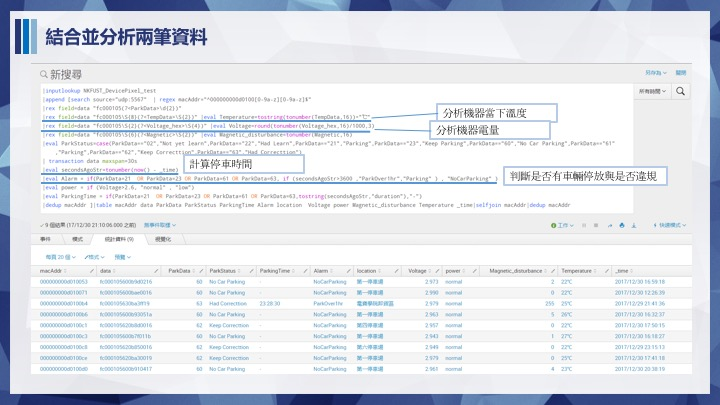
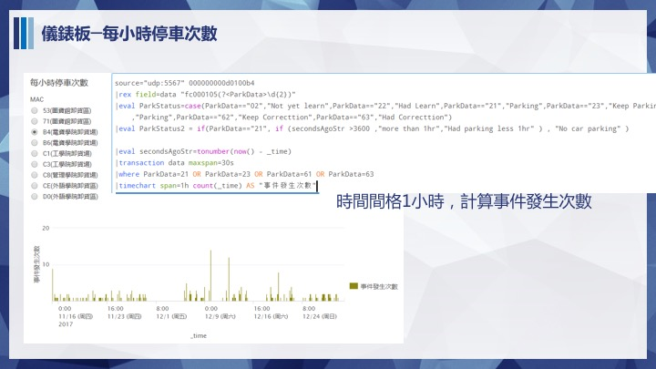

#學校網管及智慧停車系統 

#指導老師：朱彥銘 

#組員：莊博馨、曾瓊瑩、蔡心敏、林薏庭、陳沛穎 

內容:從Client端Ping各段閘道網路，校外網路用DNS測試，定時將ping的值回傳到Splunk,再由Splunk分析，若回傳時間超過訂時間，便發出Alert提醒網管人員．
而智慧停車系統則是，透過感測器偵測停車格是否有停車，將資料回傳至Splunk監看，再進行分析． 

效益:讓網管人員即時知道哪段網路出問題，且可以即時知道校園內停車狀況． 

HOW:用PYTHON寫好的程式，使用MQTT傳輸協定傳送至SPLUNK，在使用SPLUNK告警功能發出錯誤的LOG檔 
功能性需求 
1.偵測是否斷線 
2.監控網段連線狀態 
3.有異常的網段發出告警 
4.分析各時段的連線品質 
5.偵測校園那各停車格 
6.監控停車狀態 
7.分析各感測器狀態 

 非功能性需求
 1.有異常即時給使用者知道
 2.當地磁感測器沒電讓管理者知道

***

甘特圖設計https://www.smartapp.com/gantterforgoogledrive/index.html?fileID=0B2NixI49LfkmSXF6SVlWZFc2Rms#

 ***
負責人 ：蔡心敏 
對校外網路測試程式，因為學校的網路設定不能ping校外的網路，所以用對Dns傳封包的方式測試，在程式測試部分，rawsocket寫封包測試，下面是我們程式。目前使用兩個dns做測試，一個是googleDNS伺服器，另一個是hinet伺服器，原因是如果其中一台伺服器如果掛掉，另外一台伺服器還有資料上來，就代表學校網路沒有異常；如果兩台資料都傳不到就是學校網路有異常。

對校內網路測試程式對各棟閘道tracet route，是一種電腦網路工具。它可顯示封包在IP網路經過的路由器的IP位址，如果在傳送封包的過程中，在某一個節點中斷，就代表該節點出問題。校內網路如果電腦連線的是無線網路或是校外的網路是無法做tracet route，所以要直接用伺服器或是學校的有線網路做測試。

***
負責人 ：林薏庭 
一開始先在自己的電腦測試和Splunk測試，把資料丟到splunk前要先開PC的防火牆，然後再Splunk開port，利用socket程式把測試訊息丟到Splunk上面。通訊協定有分tcp、udp、http，先用udp方式傳。在PC測試成功後，便能在伺服器上面做測試，首先要先開伺服器的防火牆，在iptable上面開一個port做資料傳送的橋樑。
plunk部分主要是做資料分析，當發生異常會發出email通知管理者，所以splunk就要做alert設置。前面兩個程式測試裡面，如果發生錯誤的話資料會有erorr的訊息在裡面，在資料搜尋時對回傳的結果定如果有eroor便傳訊息給管理者的設定。此外也會監控每時段傳送訊息的數值有無發生異常，若發生異常也能立即告知server端測試的同學，檢查是否是程式出問題

***
負責人 ：曾瓊瑩 
測試的工作就是看server端這邊有沒有發生異常，splunk那邊的筆數異常，就會從伺服端這邊做檢查程式有沒有正常運作，在server的crontab會有做設定程式執行，所以如果筆數異常的話有可能就是這邊的設定出問題，必須將之前執行的程式做關閉，然後crontab做好設定，程式才能正常運作
***
  負責人 ：陳沛穎 
  使用的工具有GMS1001/7697/6509(lora)，由於需要感應車以磁場來判斷，所以使用GMS1001來判斷附近磁場，而選用lora是因為他能傳輸的距離可以15至20公，而且又低耗電，將GMS1001(地磁感測模組)焊接，接上7697以及6509，透過GMS1001感測，將資料讀取出來並且切割成容易閱讀的格式，接下來將ＬＥＤ裝上，寫上燈號控制，一開始環境學習為藍燈，為停放車為綠燈，以停放車為紅燈，由於各個地方的磁場不同後續加上校正，讓感測更正確． 
  程式碼 
  GMS1001+7697+6509 
     
#include<SoftwareSerial.h> 
#define LEDG 11 
#define LEDB 10 
#define LEDR 9 

int raw_data; 
String  raw_hex_data[255]; 
SoftwareSerial loraSerial(2, 3);// RX,TX 
unsigned long time; 
int status; 
int  s0,s4,s5; 

char A[24]= {0x14,0x02,0xFF,0xFF,0xFF,0xFF,0xFF,0xFF,0xFF,0xFF,0xFF,0xFF,0xFF,0xFF,0xFF,0xFF,0xFF,0xFF,0xFF,0xFF,0xFF,0x01,0xE8}; 
//強制校正 
char B[4]={0xAA,0x00,0x01,0x01}; 
//查詢 
char C[4]={0xAA,0x00,0x04,0x04}; 
 
 
void setup() { 
  Serial.begin(9600);  //Serial Monitor. 
  Serial1.begin(9600);  //USB-to-UART converter 
  loraSerial.begin(9600); //LoRa Serial 
 //燈號 
  pinMode(LEDR, OUTPUT); 
  pinMode(LEDG, OUTPUT); 
  pinMode(LEDB, OUTPUT); 
  digitalWrite(LEDR, LOW); 
  digitalWrite(LEDG, LOW); 
  digitalWrite(LEDB, HIGH); 
  //SLPEN input 
pinMode(0, OUTPUT); 
pinMode(4, INPUT); 
pinMode(5, INPUT); 
//10秒 
  Serial.print("RAW DATA : "); 
  Serial.write(&A[0],24);  
  Serial.write(&B[0],4); 
}  

void loop() { 
//digitalWrite(0, LOW); 
s0=digitalRead(0); 
s4=digitalRead(4); 
s5=digitalRead(5); 
delay(10); 
//Serial.print("SLPEN"); 
//Serial.println(0); 
//Serial.print("read"); 
//Serial.println(4); 
//Serial.print("stat"); 
//Serial.println(s5); 
  
  if (Serial1.available() > 0) { 
    Serial.print("RAW DATA : "); 
    for (int i = 0 ; i < 12 ; i++) { 
      //Get raw data 
      raw_data = Serial1.read(); 
      //Decimal to hex and store the data to array 
      printHex(raw_data, 2); 
      raw_hex_data[i] = String(returnHex(raw_data, 2)); 
      Serial.print(" "); 
      if (i == 11) { 
        //print status 
        Serial.println(" "); 
        Serial.print("Payload Header幀頭 : "); 
        Serial.println(raw_hex_data[0]); 
        Serial.print("Payload length 數據長度: "); 
        Serial.println(raw_hex_data[1]); 
        Serial.print("Signaling coding 信令編碼: "); 
        Serial.println(raw_hex_data[2]); 
        Serial.print("Device ID : "); 
        Serial.println(raw_hex_data[3] + " " + raw_hex_data[4] + " " + raw_hex_data[5] + " " + raw_hex_data[6]); 
        Serial.print("Status 狀態: "); 
        Serial.println(raw_hex_data[7]); 
        
        Serial.print("Voltage 電壓: "); 
        Serial.println(raw_hex_data[8]); 
        Serial.print("Magnetic strength磁擾強度: "); 
        Serial.println(raw_hex_data[9] + " " + raw_hex_data[10]); 
        Serial.print("Checksum 效驗碼: "); 
        Serial.println(raw_hex_data[11]); 
         
        if (raw_hex_data[7] == "00") { 
          Serial.print("Is there a Car?: "); 
          Serial.println("Haven't car"); 
          loraSerial.println("AT+DTX=2,00"); 
          String txtMsg = loraSerial.readString(); 
          Serial.println(txtMsg); 
          digitalWrite(LEDR, LOW); 
          digitalWrite(LEDG, HIGH); 
          digitalWrite(LEDB, LOW); 
        } 
        else if (raw_hex_data[7] == "01") { 
          Serial.print("Is there a Car?: "); 
          Serial.println("Have car"); 
          loraSerial.println("AT+DTX=2,01"); 
          String txtMsg = loraSerial.readString(); 
          Serial.println(txtMsg); 
          digitalWrite(LEDR, HIGH); 
          digitalWrite(LEDG, LOW); 
          digitalWrite(LEDB, LOW); 
        } 
        else if (raw_hex_data[7] == "02") { 
          Serial.println("Test"); 
          loraSerial.println("AT+DTX=2,02"); 
          String txtMsg = loraSerial.readString(); 
          Serial.println(txtMsg); 
          digitalWrite(LEDR, LOW); 
          digitalWrite(LEDG, LOW); 
          digitalWrite(LEDB, HIGH); 
 
        }
        Serial.println("------------------------------------------------------"); 
      } 
    } 
  } 
} 

 

//Decimal to Hex function 
void printHex(int num, int precision) { 
  char tmp[16]; 
  char format[128]; 
  sprintf(format, "%%.%dX", precision); 
  sprintf(tmp, format, num); 
 
  Serial.print(tmp); 
} 

//Decimal to Hex function 
String returnHex(int num, int precision) { 
  char tmp[16]; 
  char format[128]; 
 
  sprintf(format, "%%.%dX", precision); 
  sprintf(tmp, format, num); 
 
  return tmp; 
} 
 

 ***
#負責人 ：莊博馨 
將Splunk所接收到的Lora資料與預先上傳的位置資料結合，製作成停車場監控儀表板。 
內容含有：當下停車資訊與時間、Lora剩餘電量與溫度，停車場地圖與停車狀態，每日停車百分比，每小時停車次數，原始LOG資料。 
程式碼： 
<.form> 
  <.label>校園停車場即時監控系統04<./label> 
  <.fieldset submitButton="false" autoRun="true"><./fieldset> 
  <.row> 
    <.panel> 
      <title>各停車格資訊</title> 
      <.table> 
        <title>Alarm：綠色－無停車　橘色－有停車　紅色－停車超過一小時，power：藍色－電量正常　黃色－電量過低</title> 
        <.search> 
          <.query>|inputlookup NKFUST_DevicePixel_test   
            |append [search source="udp:5567"  | regex macAddr="^000000000d0100[0-9a-z][0-9a-z]$" 
            |rex field=data "fc000105(?&lt;ParkData&gt;\d{2})"  
            |rex field=data "fc000105\S{8}(?&lt;TempData&gt;\S{2})" |eval Temperature=tostring(tonumber(TempData,16))+"℃" 
            |rex field=data "fc000105\S{2}(?&lt;Voltage_hex&gt;\S{4})" |eval Voltage=round(tonumber(Voltage_hex,16)/1000,3) 
            |rex field=data "fc000105\S{6}(?&lt;Magnetic&gt;\S{2})" |eval Magnetic_disturbance=tonumber(Magnetic,16) 
            |eval ParkStatus=case(ParkData=="02","Not yet learn",ParkData=="22","Had Learn",ParkData=="21","Parking",ParkData=="23","Keep Parking",ParkData=="60","No Car Parking",ParkData=="61","Parking",ParkData=="62","Keep Correcttion",ParkData=="63","Had Correcttion") 
            | transaction data maxspan=30s 
            |eval secondsAgoStr=tonumber(now() - _time)  
            |eval Alarm = if(ParkData=21  OR ParkData=23 OR ParkData=61 OR ParkData=63, if (secondsAgoStr&gt;3600 ,"ParkOver1hr","Parking" ) , "NoCarParking" ) 
            |eval power = if (Voltage&gt;2.6, "normal" , "low") 
            |eval ParkingTime = if(ParkData=21  OR ParkData=23 OR ParkData=61 OR ParkData=63,tostring(secondsAgoStr,"duration"),"-") 
            |dedup macAddr ]|table macAddr data ParkData ParkStatus ParkingTime Alarm location  Voltage power Magnetic_disturbance Temperature _time|selfjoin macAddr|dedup macAddr<./query> 
          <.earliest>0<./earliest> 
          <.latest><./latest> 
          <.refresh>1m<./refresh> 
          <.refreshType>delay</refreshType> 
        <./search> 
        <.format type="color" field="Alarm"> 
          <.colorPalette type="map">{"ParkOver1hr":#FF8E7F,"Parking":#FFE480,"NoCarParking":#A3FF80}</colorPalette> 
        <./format> 
        <.format type="number" field="Voltage"> 
          <.option name="precision">3<./option> 
          <.option name="unit">v<./option> 
        <./format> 
        <.format type="color" field="power"> 
          <.colorPalette type="map">{"low":#FEFF80,"normal":#80FFDA}<./colorPalette> 
        <./format> 
      <./table> 
    <./panel> 
  <./row> 
  <.row> 
    <.panel> 
      <title>停車格位置圖</title> 
      <.viz type="custom-image-map-viz.map_viz"> 
        <title>綠色－無停車　橘色－有停車　紅色－停車超過一小時　灰色：預設建置點</title> 
        <.search> 
          <.query>|inputlookup NKFUST_DevicePixel_test   
            |appendcols[search source="udp:5567" | regex macAddr="^000000000d0100[0-9a-z][0-9a-z]$"  
            |rex field=data "fc000105(?&lt;ParkData&gt;\d{2})"  
            |eval ParkStatus=case(ParkData=="02","Not yet learn",ParkData=="22","Had Learn",ParkData=="21","Parking",ParkData=="23","Keep Parking",ParkData=="60","No Car Parking",ParkData=="61","Parking",ParkData=="62","Keep Correcttion",ParkData=="63","Had Correcttion") 
            |eval secondsAgoStr=tonumber(now() - _time) |dedup macAddr |sort macAddr 
            |table macAddr data ParkData ParkStatus  _time time secondsAgoStr rssi snr ] 
            |rex field=macAddr "000000000d0100(?&lt;ID&gt;\w{2})" 
            |eval newy=Pixel_Y, newx=Pixel_X, coordinates=newy.",".newx ,description=ID,markerColor=if(ParkData=21 OR ParkData=23 OR ParkData=61 OR ParkData=63,if(secondsAgoStr&gt;3600,"lightred","beige"),if(ParkData=21 OR ParkData=22 OR ParkData=60 OR ParkData=62,"lightgreen","lightgray")),iconColor="#fbff7a" 
            |eval status=if(ParkData=21 OR ParkData=23 OR ParkData=61 OR ParkData=63,"Parking","NoCarParking") 
            | table description,coordinates,newx,newy,ParkStatus,markerColor,iconColor<./query> 
          <.earliest>0<./earliest> 
          <.latest><./latest> 
          <.refresh>1m<./refresh> 
          <.refreshType>delay<./refreshType> 
        <./search> 
        <.option name="custom-image-map-viz.map_viz.allPopups">0<./option> 
        <.option name="custom-image-map-viz.map_viz.backgroundColor">#FFF<./option> 
        <.option name="custom-image-map-viz.map_viz.defaultHeight">460<./option> 
        <.option name="custom-image-map-viz.map_viz.drilldown">0<./option> 
        <.option name="custom-image-map-viz.map_viz.focusClicked">1<./option> 
        <.option name="custom-image-map-viz.map_viz.fullScreen">1<./option> 
        <.option name="custom-image-map-viz.map_viz.mapCenterX">565<./option> 
        <.option name="custom-image-map-viz.map_viz.mapCenterY">525<./option> 
        <.option name="custom-image-map-viz.map_viz.mapCenterZoom">0<./option> 
        <.option name="custom-image-map-viz.map_viz.mapHeight">840<./option> 
        <.option name="custom-image-map-viz.map_viz.mapImage">east_schoolmap.PNG<./option> 
        <.option name="custom-image-map-viz.map_viz.mapWidth">1166<./option> 
        <.option name="custom-image-map-viz.map_viz.maxZoom">0<./option> 
        <.option name="custom-image-map-viz.map_viz.minZoom">0<./option> 
        <.option name="custom-image-map-viz.map_viz.multiplePopups">0<./option> 
        <.option name="custom-image-map-viz.map_viz.scrollWheelZoom">1<./option> 
        <.option name="custom-image-map-viz.map_viz.showPath">0<./option> 
        <.option name="custom-image-map-viz.map_viz.showPointerCoordinates">1<./option> 
        <.option name="custom-image-map-viz.map_viz.unfocusedOpacity">0.1<./option> 
        <.option name="refresh.display">preview<./option> 
      <./viz> 
    <./panel> 
  <./row> 
  <.row> 
    <.panel> 
      <title>每日停車百分比</title> 
      <.chart> 
        <.search> 
          <.query>source="udp:5567"  earliest=-1d@d | regex macAddr="^000000000d0100[0-9a-z][0-9a-z]$" 
            |rex field=data "fc000105(?&lt;ParkData&gt;\d{2})"  
            |eval ParkStatus=case(ParkData=="02","Not yet learn",ParkData=="22","Had Learn",ParkData=="21","Parking",ParkData=="23","Keep Parking",ParkData=="60","No Car Parking",ParkData=="61","Parking",ParkData=="62","Keep Correcttion",ParkData=="63","Had Correcttion") 
            |eval secondsAgoStr=tonumber(now() - _time)  
            |table macAddr data ParkData ParkStatus  _time time secondsAgoStr   rssi snr  
            |transaction data maxspan=30s //將資料聚集成交易模式，時間是30s內的資料同個DATA的  
            |transaction macAddr  startswith="ParkData=61" endswith="ParkData=60" |eval TotalTime=toString(duration,"duration") |rename TotalTime as "此次停車總時間"  
            |eventstats sum(duration) AS Today_Parking_TotalTime  
            |eval percentage=round(duration/Today_Parking_TotalTime*100 ,2) |eval percentage=tostring(percentage+"%") 
            | addcoltotals labelfield=Today_Parking_TotalTime label=Today_Parking_TotalTime  
            |fields - _raw ,- closed_txn ,- field_match_sum , - linecount ,- Today_Parking_TotalTime  
            |chart values(duration) over _time |rename values(duration) AS "每日停車時間與百分比"<./query> 
          <.earliest>0<./earliest> 
          <.latest><./latest> 
          <.refresh>1m<./refresh> 
          <.refreshType>delay<./refreshType> 
        <./search> 
        <.option name="charting.chart">pie<./option> 
      <./chart> 
    <./panel> 
    <.panel> 
      <title>每日最低電量</title> 
      <.input type="radio" token="macAddr04"> 
        <.label>MAC<./label> 
        <.choice value="000000000d010053">53(圖資館卸貨區)<./choice> 
        <.choice value="000000000d010071">71(圖資館卸貨區)<./choice> 
        <.choice value="000000000d0100b4">B4(電資學院卸貨場)<./choice> 
        <.choice value="000000000d0100b6">B6(電資學院卸貨場)<./choice> 
        <.choice value="000000000d0100c1">C1(工學院卸貨場)<./choice> 
        <.choice value="000000000d0100c3">C3(工學院卸貨場)<./choice> 
        <.choice value="000000000d0100c8">C8(管理學院卸貨場)<./choice> 
        <.choice value="000000000d0100ce">CE(外語學院卸貨區)<./choice> 
        <.choice value="000000000d0100d0">D0(外語學院卸貨區)<./choice> 
        <.default>000000000d0100b4<./default> 
      <./input> 
      <.chart> 
        <title>電量</title> 
        <.search> 
          <.query>source="udp:5567" $macAddr04$ 
            |rex field=data "fc000105\S{2}(?&lt;Voltage_hex&gt;\S{4})" |eval Voltage=round(tonumber(Voltage_hex,16)/1000,3) 
            |transaction data maxspan=30s 
            |timechart min(Voltage) by macAddr span=1d<./query> 
          <.earliest>0<./earliest> 
          <.latest><./latest> 
          <.refresh>1m<./refresh> 
          <.refreshType>delay<./refreshType> 
        <./search> 
        <.option name="charting.chart">line<./option> 
      <./chart> 
    <./panel> 
  <./row> 
  <.row> 
    <.panel> 
      <title>每小時停車次數</title> 
      <.input type="radio" token="macAddr01"> 
        <.label>MAC<./label> 
        <.choice value="000000000d010053">53(圖資館卸貨區)<./choice> 
        <.choice value="000000000d010071">71(圖資館卸貨區)<./choice> 
        <.choice value="000000000d0100b4">B4(電資學院卸貨場)<./choice> 
        <.choice value="000000000d0100b6">B6(電資學院卸貨場)<./choice> 
        <.choice value="000000000d0100c1">C1(工學院卸貨場)<./choice> 
        <.choice value="000000000d0100c3">C3(工學院卸貨場)<./choice> 
        <.choice value="000000000d0100c8">C8(管理學院卸貨場)<./choice> 
        <.choice value="000000000d0100ce">CE(外語學院卸貨區)<./choice> 
        <.choice value="000000000d0100d0">D0(外語學院卸貨區)<./choice> 
        <.default>000000000d0100b4<./default> 
      <./input> 
      <.chart> 
        <.search> 
          <.query>source="udp:5567" $macAddr01$ 
            |rex field=data "fc000105(?&lt;ParkData&gt;\d{2})"  
            |eval ParkStatus=case(ParkData=="02","Not yet learn",ParkData=="22","Had Learn",ParkData=="21","Parking",ParkData=="23","Keep Parking",ParkData=="60","No Car Parking",ParkData=="61","Parking",ParkData=="62","Keep Correcttion",ParkData=="63","Had Correcttion")  
            |eval ParkStatus2 = if(ParkData=="21", if (secondsAgoStr &gt;3600 ,"more than 1hr","Had parking less 1hr" ) , "No car parking" ) 
            |eval secondsAgoStr=tonumber(now() - _time) 
            |transaction data maxspan=30s 
            |where ParkData=21 OR ParkData=23 OR ParkData=61 OR ParkData=63 
            |timechart span=1h count(_time) AS "事件發生次數"<./query> 
          <.earliest>0<./earliest> 
          <.latest><./latest> 
          <.refresh>1m<./refresh> 
          <.refreshType>delay<./refreshType> 
        <./search> 
        <.option name="charting.chart">column<./option> 
      <./chart> 
    <./panel> 
    <.panel> 
      <title>每日停車次數</title> 
      <.input type="radio" token="macAddr02"> 
        <.label>MAC<./label> 
        <.choice value="000000000d010053">53(圖資館卸貨區)<./choice> 
        <.choice value="000000000d010071">71(圖資館卸貨區)<./choice> 
        <.choice value="000000000d0100b4">B4(電資學院卸貨場)<./choice> 
        <.choice value="000000000d0100b6">B6(電資學院卸貨場)<./choice> 
        <.choice value="000000000d0100c1">C1(工學院卸貨場)<./choice> 
        <.choice value="000000000d0100c3">C3(工學院卸貨場)<./choice> 
        <.choice value="000000000d0100c8">C8(管理學院卸貨場)<./choice> 
        <.choice value="000000000d0100ce">CE(外語學院卸貨區)<./choice> 
        <.choice value="000000000d0100d0">D0(外語學院卸貨區)<./choice> 
        <.default>000000000d0100b4<./default> 
      <./input> 
      <.chart> 
        <.search> 
          <.query>source="udp:5567" $macAddr02$ 
            |rex field=data "fc000105(?&lt;ParkData&gt;\d{2})"  
            |eval ParkStatus=case(ParkData=="02","Not yet learn",ParkData=="22","Had Learn",ParkData=="21","Parking",ParkData=="23","Keep Parking",ParkData=="60","No Car Parking",ParkData=="61","Parking",ParkData=="62","Keep Correcttion",ParkData=="63","Had Correcttion")  
            |eval ParkStatus2 = if(ParkData=="21", if (secondsAgoStr &gt;3600 ,"more than 1hr","Had parking less 1hr" ) , "No car parking" ) 
            |eval secondsAgoStr=tonumber(now() - _time) 
            |transaction data maxspan=30s 
            |table data Temperature ParkData ParkStatus ParkStatus2 _time secondsAgoStr  rssi snr  
            |where ParkData=21  OR ParkData=23 OR ParkData=61 OR ParkData=63 
            |timechart span=1d count(_time) AS "停車次數"<./query> 
          <.earliest>0<./earliest> 
          <.latest><./latest> 
          <.refresh>1m<./refresh> 
          <.refreshType>delay<./refreshType> 
        <./search> 
        <.option name="charting.chart">line<./option> 
      <./chart> 
    <./panel> 
  <./row> 
  <.row> 
    <.panel> 
      <title>停車格原始資料</title> 
      <.input type="dropdown" token="macAddr"> 
        <.label>MAC<./label> 
        <.choice value="000000000d010053">53(圖資館卸貨區)<./choice> 
        <.choice value="000000000d010071">71(圖資館卸貨區)<./choice> 
        <.choice value="000000000d0100b4">B4(電資學院卸貨場)<./choice> 
        <.choice value="000000000d0100b6">B6(電資學院卸貨場)<./choice> 
        <.choice value="000000000d0100c1">C1(工學院卸貨場)<./choice> 
        <.choice value="000000000d0100c3">C3(工學院卸貨場)<./choice> 
        <.choice value="000000000d0100c8">C8(管理學院卸貨場)<./choice> 
        <.choice value="000000000d0100ce">CE(外語學院卸貨區)<./choice> 
        <.choice value="000000000d0100d0">D0(外語學院卸貨區)<./choice> 
        <.default>000000000d0100b4<./default> 
      <./input> 
      <.table> 
        <.search> 
          <.query>source="udp:5567"  $macAddr$ 
            |rex field=data "fc000105(?&lt;ParkData&gt;\d{2})"  
            |rex field=data "fc000105\S{8}(?&lt;TempData&gt;\S{2})" |eval Temperature=tostring(tonumber(TempData,16))+"℃" 
            |rex field=data "fc000105\S{2}(?&lt;Voltage_hex&gt;\S{4})"  
            |eval Voltage=tostring(round(tonumber(Voltage_hex,16)/1000,3))+"v" 
            |rex field=data "fc000105\S{6}(?&lt;Magnetic&gt;\S{2})" |eval Magnetic_disturbance=tonumber(Magnetic,16) 
            |eval ParkStatus=case(ParkData=="02","Not yet learn",ParkData=="22","Had Learn",ParkData=="21","Parking",ParkData=="23","Keep Parking",ParkData=="60","No Car Parking",ParkData=="61","Parking",ParkData=="62","Keep Correcttion",ParkData=="63","Had Correcttion") 
            |table data ParkData ParkStatus Voltage Magnetic_disturbance Temperature _time rssi snr<./query> 
          <.earliest>0<./earliest> 
          <.latest><./latest> 
          <.refresh>1m<./refresh> 
          <.refreshType>delay<./refreshType> 
        <./search> 
        <.option name="count">15<./option> 
        <.option name="rowNumbers">true<./option> 
      <./table> 
    <./panel> 
  <./row> 
<./form> 
***
＃期末簡報 

