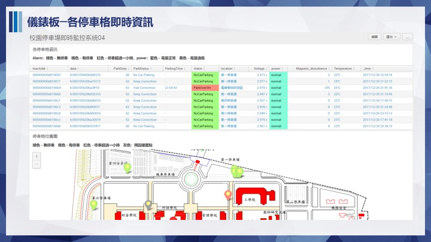

#學校網管及智慧停車系統 

#指導老師：朱彥銘 

#組員：莊博馨、曾瓊瑩、蔡心敏、林薏庭、陳沛穎 

內容:從Client端Ping各段閘道網路，校外網路用DNS測試，定時將ping的值回傳到Splunk,再由Splunk分析，若回傳時間超過訂時間，便發出Alert提醒網管人員．
而智慧停車系統則是，透過感測器偵測停車格是否有停車，將資料回傳至Splunk監看，再進行分析． 

效益:讓網管人員即時知道哪段網路出問題，且可以即時知道校園內停車狀況． 

HOW:用PYTHON寫好的程式，使用MQTT傳輸協定傳送至SPLUNK，在使用SPLUNK告警功能發出錯誤的LOG檔 
功能性需求 
1.偵測是否斷線 

2.監控網段連線狀態 

3.有異常的網段發出告警 
4.分析各時段的連線品質 

5.偵測校園那各停車格 
6.監控停車狀態 
7.分析各感測器狀態 

 非功能性需求
 1.有異常即時給使用者知道
 2.當地磁感測器沒電讓管理者知道

***

甘特圖設計https://www.smartapp.com/gantterforgoogledrive/index.html?fileID=0B2NixI49LfkmSXF6SVlWZFc2Rms#

 ***
負責人 ：蔡心敏
  程式碼
***
負責人 ：林薏庭
  程式碼
***
負責人 ：曾瓊瑩
  程式碼
***
  負責人 ：陳沛穎 
  程式碼 
  GMS1001+7697+6509 
     
#include <RHSoftwareSPI.h> 
#include <RHGenericSPI.h> 
#include <SPI.h> 

#include <SPI.h> 
#include <Ethernet.h> 

//Sensor Setup 
//Ethernet Shield Setup 
// Enter a MAC address for your controller below. 
// Newer Ethernet shields have a MAC address printed on a sticker on the shield 
byte mac[] = { 0xDE, 0xAD, 0xBE, 0xEF, 0xFE, 0xED }; 
// if you don't want to use DNS (and reduce your sketch size) 
// use the numeric IP instead of the name for the server: 
IPAddress server(10,14,0,85);  // numeric IP for Google (no DNS) 
//char server[] = "www.google.com";    // name address for Google (using DNS) 
//If you want to use DNS for your server 
// Set the static IP address for the ethernet shield 
// to use if the DHCP fails to assign 
IPAddress ip(168,95,1,1); 

// Initialize the Ethernet client library 
// with the IP address and port of the server 
// that you want to connect to (port 80 is default for HTTP): 
EthernetClient client; 
DHT dht(DHTPIN, DHTTYPE); 

void setup() { 
  // Open serial communications and wait for port to open: 
  Serial.begin(9600); 
  //just a startup delay, to let the little guy wake up 
  delay(1000); 
  // start the Ethernet connection: 
  if (Ethernet.begin(mac) == 0) { 
    Serial.println("Failed to configure Ethernet using DHCP"); 
    // try to congifure using IP address instead of DHCP: 
    Ethernet.begin(mac, ip); 
  } 
  // give the Ethernet shield a second to initialize: 
  Serial.print("My IP address: "); 
  // Print out the IP address, in case you need to wireshark the transaction 
  Serial.println(Ethernet.localIP()); 
  
  //init our DHT11 temp sensor 
  dht.begin(); 
} 

void loop() 
{ 
  delay(5000); 
  // Reading temperature or humidity takes about 250 milliseconds! 
  // Sensor readings may also be up to 2 seconds 'old' (its a very slow sensor) 
  float h = dht.readHumidity(); 
  // Read temperature as Fahrenheit (isFahrenheit = true) 
  float f = dht.readTemperature(true); 
  // Check if any reads failed and exit early (to try again). 
  if (isnan(h) || isnan(f)) { 
    Serial.println("Failed to read from DHT sensor!"); 
  } 
 
  //quick read of the incoing traffic on the shield...if any 
  if (client.available()) { 
    char c = client.read(); 
  } 

  //wait a bit more 10000 millis before sending the request to Splunk 
  delay(10000); 
  sendHttpRequest(h, f); 
  
 

} 

void sendHttpRequest(float h, float f){ 
  //close any current connections 
  client.stop(); 
  //set up our payload as a string 
  String stringF = String(f, 3); 
  String stringH = String(h, 3); 
  String payload = "{ \"host\" : \"arduino\", \"sourcetype\" : \"arduino\", \"index\" : \"arduino\", \"event\" :  {\"temp\" : \"" + stringF + "\" , \"humidity\": \"" + stringH + "\" }}"; 

  // if you get a connection, report back via serial 
  //also set client port to 8088 default for HTTP event collector 
  if (client.connect(server, 8088)) { 
    Serial.println("connected"); 
    // Make an HTTP POST request to our event collector endpoint 
    client.println("POST /services/collector HTTP/1.1"); 
    // add our authorization header 
    // add your key below after "Splunk" 
    client.println("Authorization: Splunk 2B6461AC-FE4E-4EE6-80B0-11E38DF58C2D"); 
    //send our JSON payload 
    //uncomment below if you care about the content-type headers...I do not 
    //client.println("Content-Type: application/x-www-form-urlencoded;"); 
    //Content-Length header is ABSOLUTELY required, otherwise Splunk doesnt know 
    //how long to keep the connection open 
    client.print("Content-Length: "); 
    client.println(payload.length()); 
    //required to add a space to delineate our payload from the header info 
    client.println(); 
    client.println(payload); 
    client.println(); 
  } 
  else { 
    // if you didn't get a connection to the server: 
    Serial.println("connection failed"); 
  } 
 
} 
 ***
#負責人 ：莊博馨
##程式碼

***
＃期末簡報

